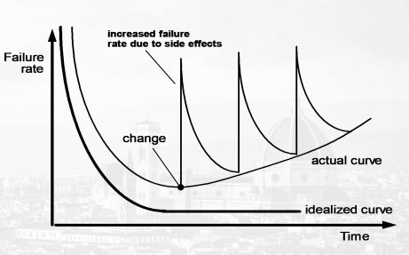
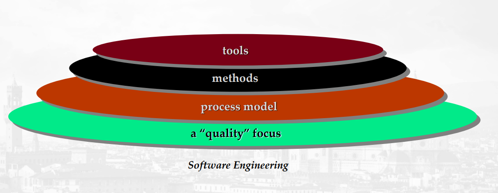
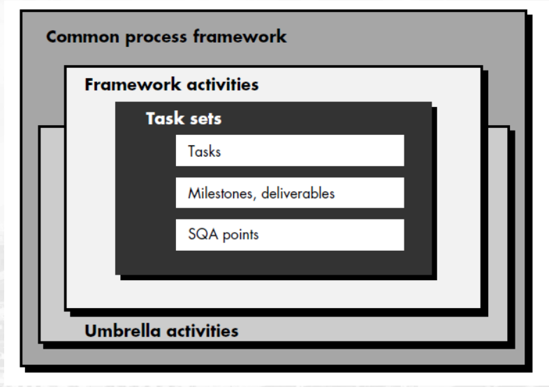

<!-- markdownlint-disable MD024 -->
<!-- MD024 - Multiple headings with the same content -->

# Chapter 1 - Software Process

## Introduction to software engineering

### What is software

Software is :-

- Instructions (computer programs) that when executed provide desired features, function, and performance
- Data structures that enable the programs to adequately manipulate information
- Documentation that describes the operation and use of the program

IEE definition :-

- The application of a systematic, disciplined, quantifiable approach to the development, operation, and maintenance of software; i.e. the application of engineering to software
- The study of the approaches mentioned above

### Characteristics of software

- Software is developed or engineerd, it is not manufactured in the classical sense
- Software doesn't "wear out"
- Although the industry is moving towards componentbased construction, most software continues to be custom-built

### Software Applications

- System software - OS, compilers, interpreters, assemblers, etc.
- Application software - Microsoft Office suite, etc.
- Engineering/scientific - CAD, space shuttle, etc.
- Embedded - Embedded in hardware, written particularly for it, and processing/memory constraints because of the limited capabilities
- Web applications - Client-server program running in our browsers.
- AI - ANN, robotics, pattern recognition, etc.

### Software - A Layered Techonology

### Software - A Process Framework

#### Common Process Framework Activities

- Communication
- Planning
- Modelling
  - Analysis of requirements
  - Design
- Construction
  - Code generation
  - Testing
- Deployment

### Umbrella Activities

- Software project management
- Formal technical reviews
- Software quality assurance
- Software configuration management
- Work product preparation and production
- Reusability managerment
- Measurement
- Risk management

### Identifying a task set

- Before we can proceed with a process model, we need to check what actions for appropriate for a framework activity given the nature of the problem, and the stakeholders

- A task set defines the actual work to be done to accomplish the objectives of a software engineering actions
  - A list of the tasks to be accomplished
  - A list of the work products to be produced
  - A list of the quality assurance filters to be applied

- For example, for a small software project requested by one person with a simple set of requirements, the communication activity might encompass a little more than a phone call with the stakeholders. The work tasks would be:
  - Make contact with the stakeholders
  - Discuss requirements and note them down
  - Organize notes into a brief written statement of requirements
  - E-mail the stakeholders to review and approve this

### Software myths

#### Management myths

##### Myth

- We have a book full of standards/procedurs for building software, shouldn't that provide their team with everything they need to know

##### Reality

- It may very well exist, but is it used?
- Are software practitioners aware of its existence? Does it reflect modern software engineering practices?
- Is it complete? Is it streamlined to improve delivery time while still maintaining a focus on quality
- In many cases, the answer to all the above questions is "no"

##### Myth

- If the project is behind schedule, increasing the number of programmers can reduce the time required for completion

##### Reality

- Adding more manpower to a project which is already behind schedule can further slow down the development process
- New developers will take time to learn about the project and understand the codebase, as compared to those who were working on it since the beginning

##### Myth

- If the project is outsourced to a third party, the management can relax and let the other firm develop the software for them

##### Reality

- Outsourcing software to a third party does not help the organization, which is incompetent in managing and controlling the software project internally. They will invariably suffer.

#### Customer myths

##### Myth

- Brief requirements stated in the initial process is enough to start the development, detailed requirements can be given later

##### Reality

- Starting the development with an incomplete/ambiguos set of requirements can lead to software failure. A complete and format description of the requirements is essential before development starts
- Change in requirements often involves repeating the entire development process

##### Myth

- Software is flexible, hence software reuqirements can be changed at any phase of the development process

##### Reality

- Incorporating change requests earlier in the development process is easier, making such changes later in the development process may be expensive, it may require re-designing and extra resources

#### Developer myths

##### Myth

- Software development is considered complete when the code is delivered

##### Reality

- 50-70% of the effors are expended after the software is delivered to the customer

##### Myth

- The success of a software project depends on the quality of the product produced

##### Reality

- The quality of the program is not the only factor that makes a project successful. Proper documentation and configuration of the software also plays a crucial role in this.

##### Myth

- Software engineering requires unnnecessary documentation, which slows down the project

##### Reality

- Software engineering is about ensuring proper quality at every level of the project. Proper documentation enhances the quality of the project.

##### Myth

- The only product delivered after completion is the working program

##### Reality

- Even the documentation to guide the users on how to use it

##### Myth

- Quality can only be assessed after execution

##### Reality

- Quality can be measured during any phase of the development process by applicating some QA mechanisms, such as format technical review

### The software process

- A structured set of activites required to develop a software system
- There are various processes, but all involve the following:
  - Specification - defining what the system should do
  - Design and implementation - Defining the organization of and implementing the system
  - Validation - Checking that it does what the customer wants
  - Evolution - Changing the system in response to the customer's needs
- A software process model is an abstract representation of a process. It presents a description of a process from some particular perspective

### Definition of software process

- A framework for the actitives, actions, and tasks that are required to build high-quality software.
- It defines the approach that is taken as software is engineered
- It is not the same as software engineering, which also includes the technologies that populate the process - technical methods and autoamted tools

### A Generic Process Model

- A generic process framework for software engineering defines give framework activities - communication, planning, modelling, construction, and deployment.
- In addition, a set of umbrella activities are applied throughout the project.

### Process Flow

- Linear process flow executes each of the five activities in sequence
- An iterative process flow repeats one of more of the activities before proceeding to the next
- An evolutionary process flow executes the activities in a circular manner
